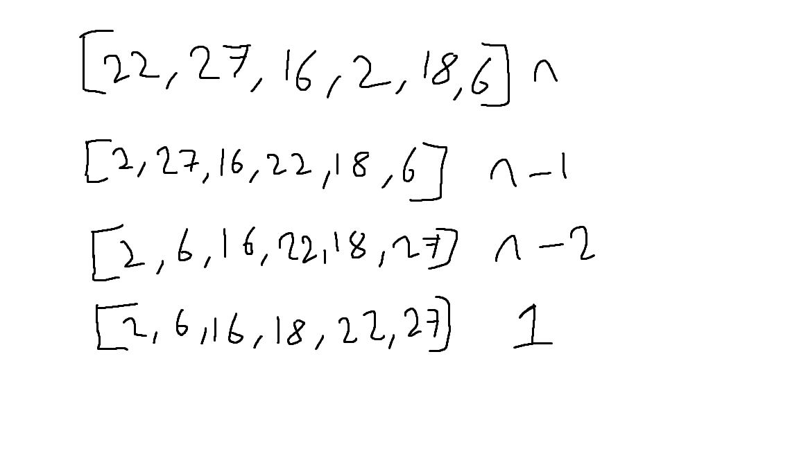
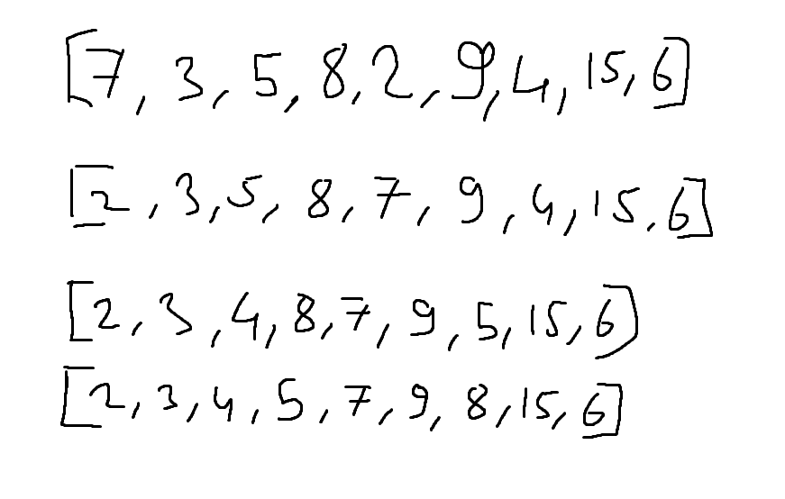

#  Yukarı verilen dizinin sort türüne göre aşamalarını yazınız.

 # Big-O gösterimini yazınız.

  n+(n-1)+(n-2)+(n-3)+(n-4)+1= (n(n+1))/2= n^2 Big-O = n^2

# Time Complexity: Dizi sıralandıktan sonra 18 sayısı aşağıdaki case'lerden hangisinin kapsamına girer? Yazınız
        Average case: Aradığımız sayının ortada olması
        Worst case: Aradığımız sayının sonda olması
        Best case: Aradığımız sayının dizinin en başında olması.

     Aradığımız sayı dizinin ortasında. Average case.

# [7,3,5,8,2,9,4,15,6] dizisinin Selection Sort'a göre ilk 4 adımını yazınız.

  
