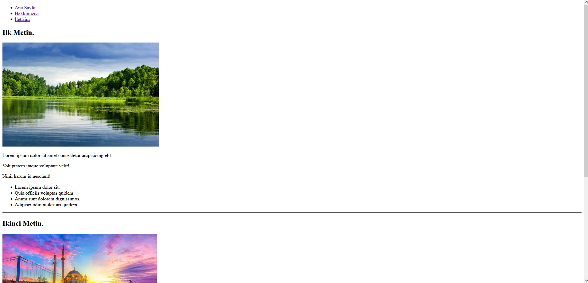
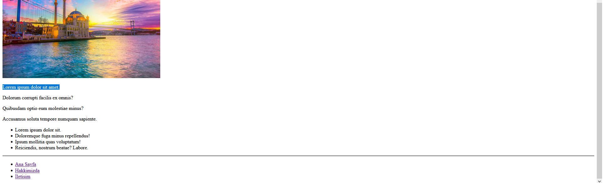
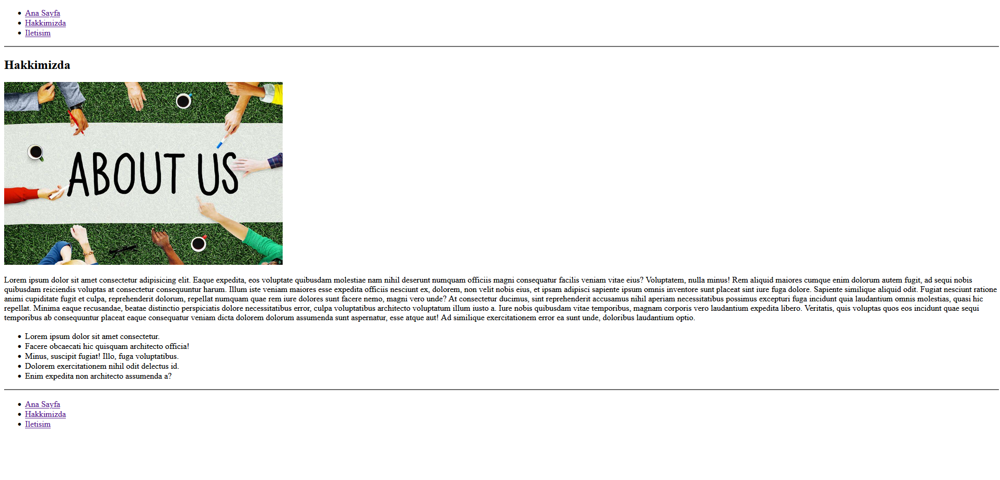
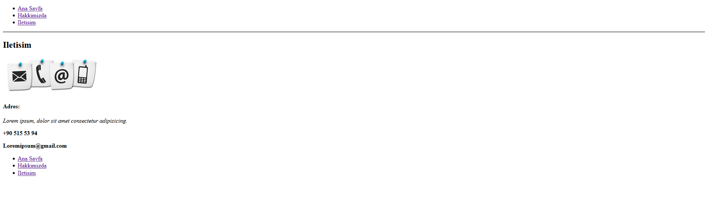
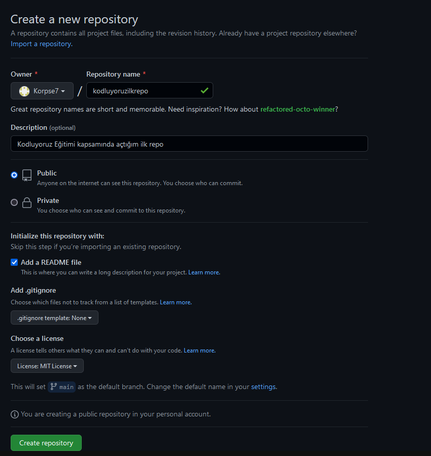

# kodluyoruzilkwebsite
Kodluyoruz Eğitimi kapsamında açtığım ilk website
# Kodluyoruz ilk website

Bu repo [kodluyoruz](https://app.patika.dev/courses/git/odev1) Front-End Egitiminde olusturdugumuz ilk website. Icerisinde bir adet README dosyasi; bir adet index.html barindiriyor






## Installation

Öncelikle projeyi clonelayin.(https://github.com/Korpse7/kodluyoruzilkrepo) 


```bash
git clone https://github.com/Korpse7/kodluyoruzilkrepo
```

## Usage

Projeyi cloneladıktan sonra Visual Studio Code programında açınız.

Linux için:
```linux
cd kodluyoruzilkrepo
code .
```

## Contributing
Pull requestler kabul edilir. Büyük değişiklikler için, lütfen önce neyi değiştirmek istediğinizi tartışmak için bir konu açınız.


## License
[MIT](https://choosealicense.com/licenses/mit/)
